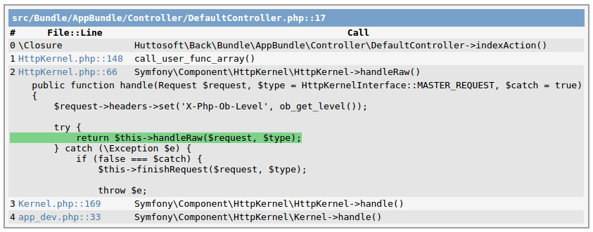

[](https://github.com/steevanb/php-backtrace/tree/2.0.1)
[](http://php.net)


[](https://insight.sensiolabs.com/projects/2b6dd6a0-ef48-4b5b-ba13-e825e0841be3/analyses/15)
[](https://scrutinizer-ci.com/g/steevanb/php-backtrace/)

php-backtrace
-------------

Show nice equivalent to debug_backtrace(), with caller, code preview etc.

Can be used in HTML, or with [symfony/console](https://github.com/symfony/console).

[Changelog](changelog.md)

Installation
------------

```bash
composer require-dev steevanb/php-backtrace ^2.0
```

Configuration
-------------

```php
// configure how file paths will be shown
// true : remove path prefix, based on DumpBacktrace.php path (assume it is in vendor/ dir)
// false : do not remove anything in file paths
// string : remove this prefix
\DumpBacktrace::setRemovePathPrefix($remove);
```

Dump as HTML
------------

```php
// get backtrace dump as array
\DebugBacktraceHtml::getBacktraces();
// get backtrace dump as HTML
\DebugBacktraceHtml::getDump();
// write getDump() HTML with echo
\DebugBacktraceHtml::dump();
// write getDump() HTML with echo, and exit
\DebugBacktraceHtml::eDump();
```


Dump in symfony/console application
-----------------------------------

```php
// Write dump
\DebugBacktraceConsole::dump();
// Write dump and exit
\DebugBacktraceConsole::eDump();
```

